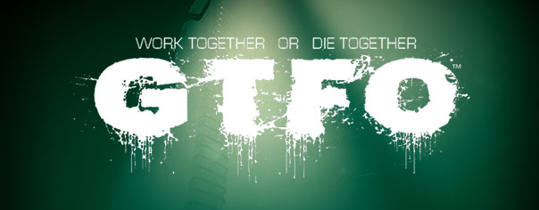
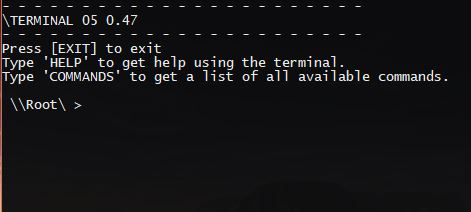
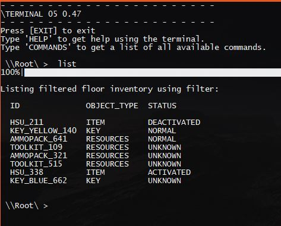

# Simulator of GTFO's In-Game Terminal
This simple python-app simulates the usable in-game terminal from the popular horror-coop-action-game called **"GTFO"**.

For more information about this game, and its terminal system, feel free to watch the following **YouTube** video:

## Demo

## The Basics
The Terminal's main usage is to locate items and objectives.
There are 3 basic commands:

- List
- Query
- Ping

Generally, you should use the commands in this order:

1. --Optional-- Use List to find out which items randomly spawned in a Zone.
2. When you find the name of an item you want more information on, use Query on that item.
3. Once you have the Zone and the name of an item, navigate to that Zone's terminal.
4. PING the name of the item from the Zone's Terminal. Use the information from the successful PING to instruct your teammates on which subZone they must go to (Zone 17 - Area B, for example). Continue issuing PING commands until your team has found the item. Alternatively, use the -t modifier to continuously ping the item until "Ctrl+C" is entered. Leaving the terminal will stop this function.

When using any of the commands, follow the command with a space and the name of the Zone/ Item. Zone names can be found on the map, written on doors, or on billboards inside rooms.

Examples of List, Query, and Ping:

- List Zone_17		(This will show that Zone_17 contains MediPack_123)
- Query MediPack_123		(This will show MediPack_123's location is Zone_17)
- Ping MediPack_123		(This will show MediPack_123's location is Zone_17 - Area B. It will also make the MediPack emit an audible sound for your teammates in Zone_17 to hear so that they can find it)

### LIST
The LIST command is used when you want to find which items have spawned in the Complex.

A LIST command can look like any of the following:

- `LIST ZONE` (recommended for beginners)
- `LIST ITEM_TYPE`
- `LIST ITEM_TYPE ZONE`

If **ONLY** a Zone is entered: The Terminal will show the names of ALL Items in the Zone.
If **ONLY** an Item_Type is entered: The Terminal will show the names of every item that matches the Item_Type in ALL Zones
If **BOTH** an Item_Type and a Zone are entered: The Terminal will show the names of every item that matches the Item_Type and is in the given Zone.

The most important things to look for when using a LIST command are _Resource Packs_. Resource Packs can be any one of the following:

- AMMO (AmmoPack)	►	LIST AMMO ZONE_NUMBER (EX: LIST AMMO ZONE_30)
- MEDIPACK (MediPack)	►	LIST MEDI ZONE_NUMBER (EX: LIST MEDI ZONE_46)
- TOOL REFILL KIT (Tool_Refill)	►	LIST TOOL ZONE_NUMBER (EX: LIST TOOL ZONE_97)

To find ANY type of Resource Pack in a Zone use the following command: LIST RESOURCE ZONE (EX: LIST RESOURCE ZONE_83).
This will list any available ammo, medical and tool packs and is a great command to use since it's a time saver and lists everything in one go, instead of inputting three separate commands.

> NOTE: You can not LIST a subZone. You must use LIST Zone_17, and can not LIST Zone_17b.

### QUERY
The QUERY command is used when you want to know something about an item _that you already have the name of_.

This command is used on:

- Resources (MEDIPACK, AMMOPACK, TOOL_REFILL, DISINFECTION_PACK)
- Objective Items (KEY, CELL, FOG_TURBINE, NEONATE_HSU, ID, PDEC)
- Doors (DOOR, SEC_DOOR)
- Storage (LOCKER, BOX)
- Other Structures (HSU, nFRAME, DPR, NCR, DISINFECTION_STATION, GENERATOR)

The terminal will show the:

1. Location
2. Ping Status
3. -- Optional (Resource Pack)-- Uses Remaining
4. -- Optional (Door)-- Where the door leads, both forwards and backwards
5. -- Optional (Door)-- Required KEY
6. -- Optional (Objective)-- Objective Information

To query an objective like an HSU would be: `QUERY HSU_XXX` (EX: HSU_123). Doing this correctly will pinpoint the Zone the HSU (Hydro-Stasis Unit) is located in.

The command to query an ammo pack would be: `QUERY AMMOPACK_304`. When done correctly the query will display the item's zone and how many uses it has remaining. It will show up as: AMMUNITION PACK - CAPACITY: 80%, indicating the ammo pack has 4 uses.

Tips:

Querying a MEDIPACK that is in an unexplored zone can help a team decide if going into the zone is worth it. A MEDIPACK with only one charge (20%) might not be worth the risk!

Querying an objective like a KEY or an HSU can help the team find where they're supposed to be going!

It is possible to traverse the entire compound from your very first Terminal! This can be done by doing the following: 
1) QUERY a door. 
2) LIST the Zone that it leads to. 
3) QUERY one of the doors that is in the LIST of the Zone. 
4) Repeat.

### PING

The PING command is used to _pinpoint the specific location of an item that you are in the same Zone as_. You must know the name (ID) of the item, so you usually must have previously done a LIST command.

A successful PING command results in two things:

1. Terminal displays Item's subZone location.
2. Item will emit a loud, audible sound for nearby players to hear.

Example of a PING command: `PING MEDIPACK_911`

> PING SUCCESS. MEDIPACK_911 found in Zone_49 Area_B

The PING command requires the player to be in the same Zone where the item is held. Otherwise the _PING command will not work_.

The PING command can be modified to continuously run by using the -t modifier. Example: PING -T MEDIPACK_911. PING will continue to ring the item until the stop command "Ctrl+C" is issued.

## References & Resources
- https://gtfo.fandom.com/wiki/Terminal
- https://gtfo.fandom.com/wiki/Terminal_Command
- https://youtu.be/Ih_g15-t2Ao?t=82
